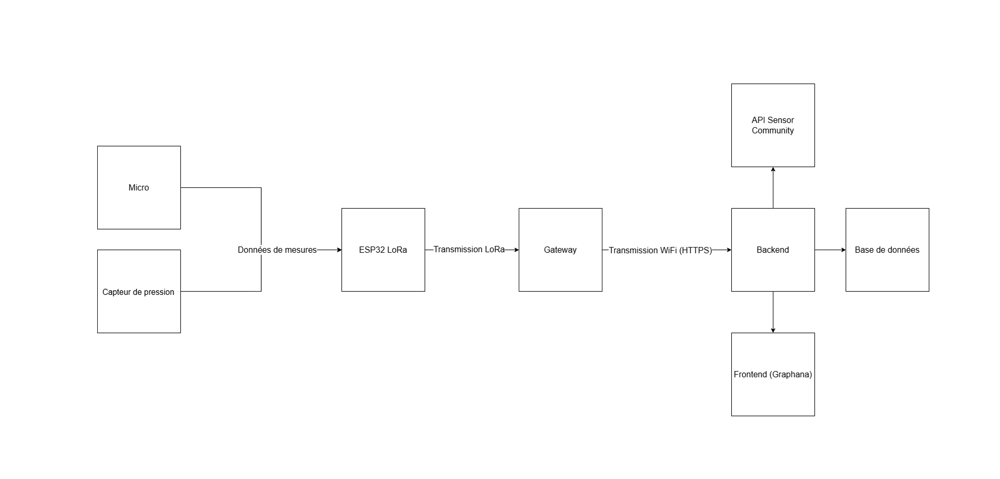
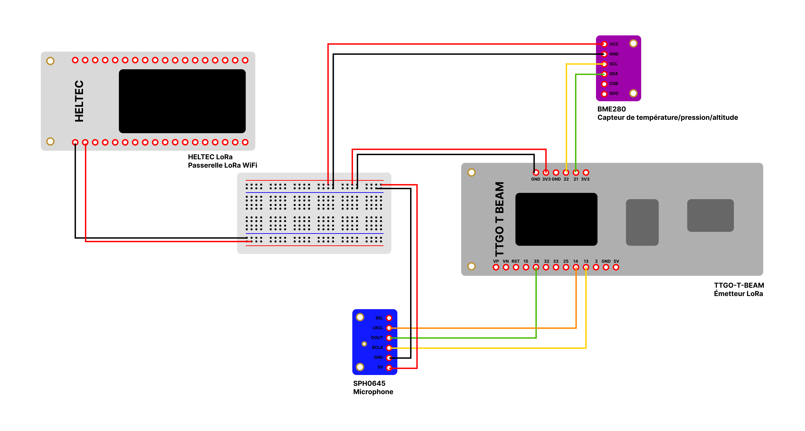

# Sensor Sensei

- [Le projet](#le-projet)
- [Architecture](#architecture)
- [Développement](#d-veloppement)
  * [Technologies](#technologies)
  * [Outils de développement](#outils-de-d-veloppement)
  * [Dépendances du firmware](#d-pendances-du-firmware)
- [Documentation](#documentation)
  * [Schéma de câblage](#sch-ma-de-c-blage)
  * [Format de données](#format-de-donn-es)
    + [Transmission LoRa](#transmission-lora)
    + [Transmission HTTPS](#transmission-https)
  * [Configuration](#configuration)
  * [Flashage des binaires](#flashage-des-binaires)
    + [Prérequis](#pr-requis)
    + [Utilisation](#utilisation)
      - [Pour la gateway](#pour-la-gateway)
      - [Pour l'IoT](#pour-l-iot)
  * [Rebuild des binaires](#rebuild-des-binaires)
- [Installation](#installation)
  * [API REST](#api-rest)
    + [Prérequis](#pr-requis-1)
  * [IoT](#iot)
    + [Prérequis](#pr-requis-2)
    + [Installation](#installation-1)


## Le projet

Le but du projet **Sensor Sensei** est de créer un objet connecté autonome capable de collecter des données environnementales (pression atmosphérique, température, position GPS, bruit, altitude) pour ensuite les envoyer à l'API **Sensor Community**.

Pour cela, le produit envoie les données collectées via le protocole LoRa à une gateway, connectée au WiFi, ce qui lui permet de les transmettre à un serveur HTTPS.

Une fois les données reçus par le serveur HTTPS, elles sont envoyées à l'API de Sensor Community et stockées en base de données afin de pouvoir être affichées sous forme de graphiques.

## Architecture

Voici l'architecture détaillée du projet :
- Un **ESP32 TTGO-T-BEAM**, qui collecte, formatte et envoie les données à la gateway LoRa. Il est équipé d'un GPS et est connecté à deux autres capteurs :
  - Un microphone **SPH0645**
  - Un capteur de température/pression atmosphérique/altitude **BME280**
- Une gateway **HELTEC WiFi LoRa 32** qui reçoit les données de l'émetteur, les reformatte et les transmet au serveur via une connexion WiFi en HTTPS
- Une **API REST** qui reçoit les données des la gateway, les stocke dans une base de données et les envoie à l'API de **Sensor Community**
- Une interface graphique qui permet de visualiser les données

**Diagramme de séquence**



## Développement

### Technologies

Le projet utilise les technologies suivantes :
- **C++** pour les firmware des émetteurs et de la gateway
- **Javascript** pour l'API REST
- **PostgreSQL** pour le stockage de données temporelles
- **Grafana** pour l'interface de monitoring web

### Outils de développement

- VSCode avec PlatformIO pour le développement des firmwares
- GitHub Actions pour l'intégration continue.
- Docker pour déployer l'API

### Dépendances du firmware

- sandeepmistry/LoRa@^0.8.0
- bblanchon/ArduinoJson@^7.4.1
- mikalhart/TinyGPSPlus@^1.0.3
- adafruit/Adafruit BMP280 Library

## Documentation

### Schéma de câblage



### Format de données

#### Transmission LoRa

**Format de base** :

    name;unit;value_name;unit;value_name;unit;value
**Séparateurs utilisés** :
- **_ (underscore)** : Sépare chaque objet de mesure complet
- **; (point-virgule)** : Sépare les champs d'un même objet (name, unit, value)

Les Séparateurs sont configurables dans les fichiers config.ini.

#### Transmission HTTPS

**Format de base (JSON)** :
```json
[
  {
    "name": "temperature",
    "unit": "°C",
    "value": 10
  },
  {
    "name": "pressure",
    "unit": "hPa",
    "value": 239
  }
]
```

### Configuration

Le projet contient 3 fichiers de configuration :
- `/iot/config.ini` : contient toute la configuration de l'émetteur LoRa et des capteurs
- `/gateway/config.ini` : contient la configuration du récpteur LoRa et de l'émetteur HTTPS
- `/gateway/secrets.ini` : contient les identifiants pour connecter la gateway au WiFi

### Flashage des binaires

#### Prérequis
- **Python** installé
- **esptool.py** : `pip install esptool`
- **Cable USB** connecté à votre carte

#### Utilisation

##### Pour la gateway
```bash
# Identifiez le port série (généralement /dev/ttyUSB0 sur Linux/Mac, COM3 sur Windows)
esptool.py --port /dev/ttyUSB0 --baud 921600 --before default_reset --after hard_reset write_flash 0x10000 gateway_YYYYMMDD_HHMMSS.bin
```

##### Pour l'IoT
```bash
# Identifiez le port série (généralement /dev/ttyUSB0 sur Linux/Mac, COM3 sur Windows)
esptool.py --port /dev/ttyUSB0 --before default_reset --after hard_reset write_flash 0x10000 iot_YYYYMMDD_HHMMSS.bin
```

### Rebuild des binaires

Les commandes
```bash
chmod +x build_all.sh;
./build_all.sh
```
permettent de générer une nouvelle version de chaque binaire dans le dossier `release`.


## Installation

### API REST

#### Prérequis

`npm`: [Accéder à la documentation officelle](https://docs.npmjs.com/downloading-and-installing-node-js-and-npm)

####Installation

    cd backend2
    docker-compose up -d

ou

    cd backend2
    npm install
    npm start`

# 📡 Documentation des routes API

## Préfixe global
Toutes les routes sont préfixées par : `/api/sensors`

## Routes disponibles

### 1. POST `/api/sensors`
- **Description** : Recevoir et stocker les données des capteurs, puis relayer à Sensor Community.
- **Body attendu** : Tableau d’objets `{ name: string, value: number, unit: string, timestamp: integer }`
- **Réponses** :
  - `201` : Données enregistrées et relayées
  - `400` : Mauvais format
  - `500` : Erreur serveur

### 2. GET `/api/sensors/all`
- **Description** : Récupérer toutes les données des capteurs stockées.

### IoT

#### Prérequis

`platformio` : [Accéder à la documentation officelle](https://docs.platformio.org/en/latest/core/installation/index.html)

#### Installation

    chmod +x start.sh
    ./start.sh
    
